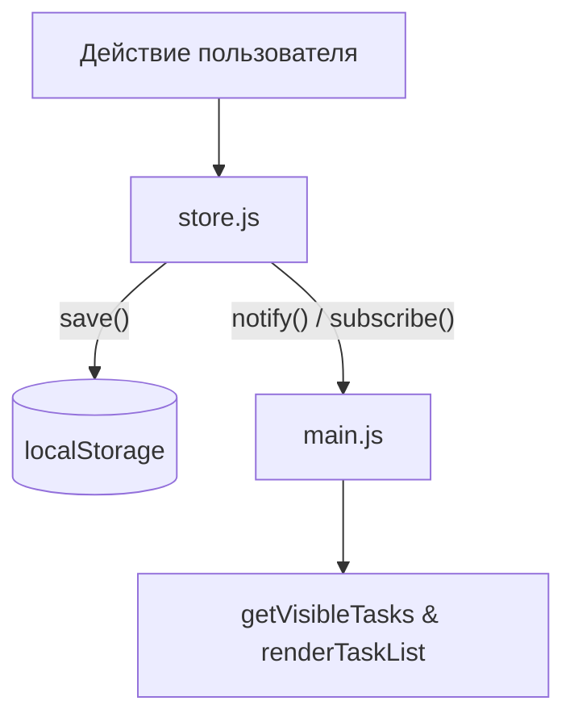
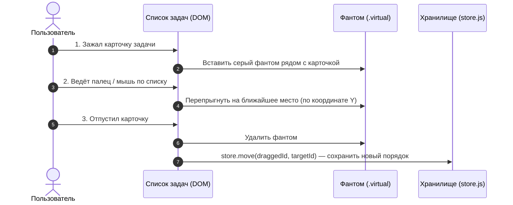

# Список задач

[ТЗ на работу](https://github.com/Dasha2101/WEB2025Q26LB2) ●
[Развернутая страница](onetwozzzplus.github.io/web-lab-2)

[](https://developer.mozilla.org/en-US/docs/Web/HTML)
[](https://developer.mozilla.org/en-US/docs/Web/CSS)
[](https://developer.mozilla.org/en-US/docs/Web/JavaScript)

## Запуск

Запустить простой http сервер, например `python3 -m http.server 8000` или vscode live server, открыть сайт.

## Структура проекта

```text
/
├── index.html              # HTML (подключение скрипта)
├── style.css               # CSS (стили)
├── assets/                 # Иконки
└── src/
    ├── main.js             # Точка входа и фильтры
    ├── store.js            # Хранилище задач
    ├── head.js             # Заполнение html/head
    └── components
        ├── Header.js       # Рендер фильтров
        ├── TaskList.js     # Рендер списка
        ├── TaskItem.js     # Рендер задачи
        └── TaskForm.js     # Рендер изменения задачи
```

## Схема работы

### Основные компоненты

- **`main.js`**: точка входа, хранит локальное состояние фильтров (`search`, `filter`, `sort`), применяет поиск/сортировку к массиву `order` и вызывает полный перерендер `TaskList`.
- **`head.js`**: подключает заголовок, иконку, стили и мета-информацию.
- **`Header.js`**: рендерит шапку с инпутом поиска и радио-кнопками фильтрации/сортировки.
- **`TaskItem.js`**: карточка задачи. Выводит заголовок, дату и кнопки управления (вверх/вниз, чекбокс, редактировать, удалить).
- **`TaskForm.js`**: простая инлайн-форма с полями `title` и `date` для добавления/редактирования.

### Поток данных (Store & Pub/Sub)

Данные живут в `store.js`:

- `tasks` — хэш-таблица объектов по `UUID`.
- `order` — массив `UUID`, определяющий порядок задач.

Хранилище работает по подписке. Любое изменение (`add`, `edit`, `remove`, `move`, `toggle`) вызывает `commit()`, который синхронизирует состояние с `localStorage` и оповещает подписчиков.



### Компонент TaskList

Основной контейнер интерфейса. Отвечает за рендеринг списка, управление формами и перетаскивание (DnD).

#### Контроль форм

В один момент времени может быть открыта **только одна** форма (создания или редактирования).

- При открытии формы скрывается кнопка `+ добавить задачу`.
- Если открыта форма, события перетаскивания и создание других форм блокируются.

#### Drag-and-Drop (Desktop + Touch)

Сортировка перетаскиванием работает **только** при режиме сортировки «вручную» (`isSorted = false`).

1. **Desktop:** используется нативный Drag and Drop API (`dragstart`, `dragover`, `drop`, `dragend`).
2. **Touch (мобилки):** самописная обработка `touchstart`, `touchmove`, `touchend` с порогом сдвига `> 5px` (чтобы не перехватывать обычный скролл).
3. **Placeholder:** во время перетаскивания создается фантомный элемент `.virtual`. Позиция вставки вычисляется функцией `getDragAfterElement()` на основе Y-координаты курсора/пальца относительно центров соседних элементов.


